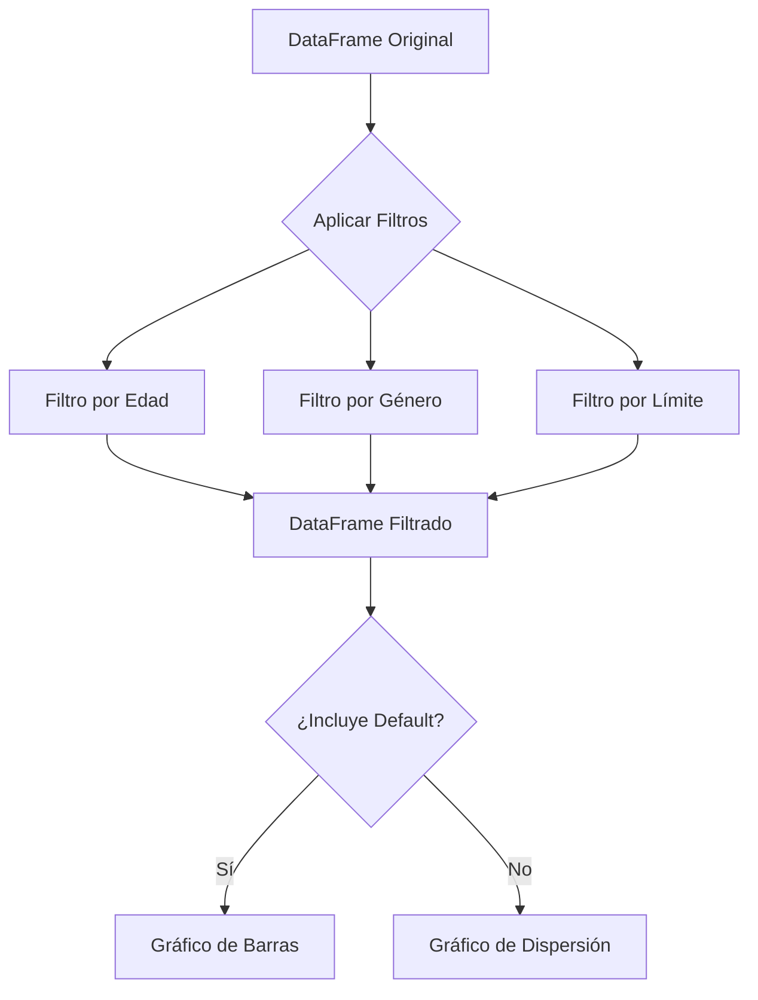

# dashboard-analisis-credit-card ->
# Credit Card Default Prediction - Data Science Project


## 📌 Descripción
Análisis predictivo de morosidad en tarjetas de crédito usando Machine Learning. Desarrollado en Google Colab con Python.

## 🚀 Características
- **ETL completo** desde dataset UCI
- **4 modelos comparados**: Regresión Logística, Árboles, GBM y Redes Neuronales
- **Dashboard interactivo** con Plotly
- **Sistema de filtrado avanzado**

## 🛠️ Tecnologías
- Python 3.9+
- Scikit-learn, XGBoost, TensorFlow
- Plotly, Pandas, NumPy

## 📂 Estructura del Repositorio

```plaintext
proyecto_default_credito/
├── dashboard/                  ← Página web con visualización interactiva
│   ├── index.html             ← Página principal con estructura profesional
│   ├── grafico_credito.html   ← Gráfica de distribución de crédito
│   ├── matriz_correlacion.html← Matriz de correlaciones entre variables
│   ├── matriz_confusion.html  ← Matriz de confusión del modelo
│   ├── importancia_variables.html ← Importancia de variables
│   └── data-science.png       ← Logo de la empresa
│
├── notebooks/
│   └── analisis_credito_colab.ipynb ← Análisis en Google Colab (EDA y modelos)
│
├── data/
│   └── default_of_credit_card_clients.csv ← Datos originales para análisis
│
└── README.md
```
## 🔥 Cómo Ejecutar
1. Abrir en Colab: [](https://colab.research.google.com/github/tu_usuario/repo)
2. Ejecutar celdas en orden
3. Para el dashboard:
```python
!pip install plotly dash
python app.py
```
## 📊 GráficaFiltrada - Explicación Técnica
El módulo graficaFiltrada permite visualizaciones dinámicas basadas en filtros de usuario:
```python
def graficaFiltrada(df, filtros):
    """
    Genera gráficos interactivos aplicando filtros multicapa
    
    Parámetros:
    -----------
    df : DataFrame
        Dataset completo de tarjetas de crédito
    filtros : dict
        Diccionario con parámetros de filtrado:
        {
            'edad': (min, max),
            'limite_credito': (min, max),
            'genero': int,
            'default': bool
        }
        
    Retorna:
    --------
    fig : plotly.graph_objects.Figure
        Gráfico interactivo con los filtros aplicados
    """
    # Aplicar filtros en cascada
    df_filtrado = df.copy()
    for key, val in filtros.items():
        if val is not None:
            if isinstance(val, tuple):
                df_filtrado = df_filtrado[df_filtrado[key].between(*val)]
            else:
                df_filtrado = df_filtrado[df_filtrado[key] == val]
    
    # Generar figura adaptativa
    if 'default' in filtros:
        fig = px.histogram(df_filtrado, x='LIMIT_BAL', color='DEFAULT')
    else:
        fig = px.scatter(df_filtrado, x='AGE', y='PAY_AMT1', color='EDUCATION')
        
    return fig
```
## Diagrama de Flujo

## 📁 Casos de Uso
```python
# Ejemplo 1: Filtrado básico
filtros = {'edad': (25, 40), 'genero': 1}
fig = graficaFiltrada(df, filtros)
fig.show()

# Ejemplo 2: Filtrado avanzado
filtros_avanzados = {
    'limite_credito': (100000, 500000),
    'default': True,
    'educacion': 2
}
```
Este proyecto corresponde a una prueba técnica para Ciencia de datos, donde se desarrollan modelos de clasificación y regresión usando el dataset público Default of Credit Card Clients. El objetivo es predecir:

🔵 Si un cliente caerá en default (clasificación).

🟢 Cuánto pagará un cliente en junio 2005 (PAY_AMT4, regresión).

## 📁 Contenido
notebook.ipynb: Desarrollo completo en Google Colab.

grafico_credito.html, matriz_correlacion.html, etc.: Gráficas interactivas.

slides_bluetab.pdf: Presentación ejecutiva con resultados y conclusiones.

README.md: Este documento.

## 📦 Dataset
Fuente: UCI Machine Learning Repository
Formato: .xls (35,000+ registros, variables financieras, sociodemográficas y comportamientos de pago).

## 🧪 Proceso realizado
1. 📊 Análisis Exploratorio (EDA)
Análisis de distribución de crédito, pagos, edad, y retrasos.

Correlación entre variables.

Identificación de valores erróneos (EDUCATION, MARRIAGE).

Balance de clases.

2. 🧹 Limpieza de Datos
Agrupación de categorías mal codificadas.

Revisión de outliers y valores faltantes.

Preparación de features numéricas/categóricas.

3. 🛠️ Feature Engineering
Variables creadas para mejorar predictibilidad:

Variable	Descripción
deuda_total	Suma de todas las deudas de los últimos 6 meses.
pago_total	Suma de pagos realizados en los últimos 6 meses.
pago_ratio	Proporción de pago respecto a deuda total.
num_retrasos	Número de meses con pagos retrasados.
avg_retraso	Promedio de atraso en meses (PAY_0 a PAY_6).

4. 🤖 Modelado
Regresión (PAY_AMT4): Modelos utilizados:

Linear Regression

Random Forest Regressor

XGBoost Regressor

Clasificación (default): Modelos utilizados:

Logistic Regression

Random Forest Classifier

XGBoost Classifier

5. 📈 Evaluación
Regresión: RMSE, R²

Clasificación: ROC AUC, matriz de confusión, F1-score

Selección por validación cruzada y métricas de desempeño.

## 📌 Resultados clave
Tarea	Mejor Modelo	Métricas Destacadas
Clasificación	XGBoostClassifier	AUC: 0.78, F1: 0.68
Regresión	RandomForestReg	R²: 0.54, RMSE: 5100

Las variables con mayor importancia en ambos modelos fueron pay_0, limit_bal, deuda_total y pago_ratio.

## 📊 Visualizaciones
Gráficos generados y exportados en formato .html:

Distribución del crédito

Matriz de correlación

Matriz de confusión

Importancia de variables

Puedes abrirlos directamente desde el navegador.

## 🧠 Conclusiones de Negocio
Los clientes con historial de retrasos y bajo pago_ratio son más propensos al default.

La predicción de pagos puede ayudar a planificar flujos de caja y alertas de riesgo.

Recomendación: implementar este modelo en procesos de scoring y asignación de crédito.

## ▶️ Reproducir el proyecto
Abre el notebook en Google Colab:
🔗 Colab Link

Asegúrate de instalar dependencias:

```bash
pip install -q plotly xgboost scikit-learn pandas matplotlib seaborn
```
Ejecuta cada celda del notebook.

👤 Autor
Liliana Becerril Tapia
Ingeniera en Energía | Ciencia de Datos | Análisis de Riesgo Financiero
